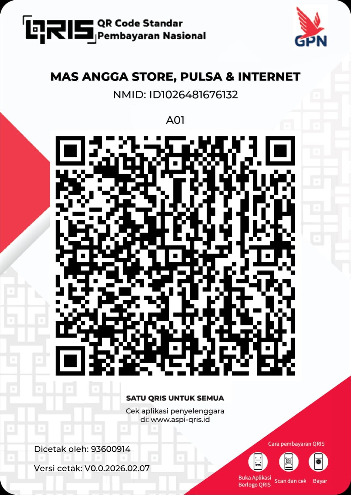

# 🚀 Scanner Pro v2.7 VIP (Cloudflare & Subdomain Hunter)


**Scanner Pro v2.7 VIP** adalah *tools* komprehensif berbasis web dan backend Node.js yang dirancang khusus untuk keperluan *Bug Hunting*, pencarian Subdomain secara masif, dan pemindaian *Port* IP (Cloudflare & Non-Cloudflare). 

Dilengkapi dengan sistem lisensi berbasis poin, *Smart Caching*, perlindungan Anti-Spam, dan dikendalikan sepenuhnya melalui **Telegram Bot Admin Panel**.

---

## ✨ Fitur Unggulan

* **🕸️ Multi-API Subdomain Grabber:** Melakukan pencarian paralel secara serentak ke 5 penyedia intelijen ancaman terkemuka (JLDC Anubis, crt.sh, AlienVault OTX, ThreatMiner, dan HackerTarget).
* **🧠 Smart Caching System:** Menyimpan hasil pencarian di memori lokal (VPS) selama 24 jam. Mengurangi beban API eksternal secara drastis dan mempercepat waktu *response* hingga 0.1 detik.
* **🎟️ Sistem Tiket Anti-Kuras Poin:** Melindungi saldo pengguna. Pemindaian pada ribuan IP sekaligus hanya akan memotong tepat 1 Poin per *batch* / sesi *scan*.
* **🆓 Limit IP Otomatis (Mode Gratis):** Membatasi akses pengguna tanpa lisensi berdasarkan IP Address (Maks. 2x Grab & 2x Scan per hari).
* **🤖 Telegram Admin Panel:** Manajemen lisensi penuh dari genggaman Anda. Buat kode lisensi VIP, cek sisa poin pengguna, dan hapus pelanggan langsung dari *chat* Telegram.
* **⚡ Auto-Filter Cloudflare:** Frontend secara otomatis mendeteksi dan memisahkan IP Cloudflare dan Non-Cloudflare yang berstatus **Active**.
* **📱 Ramah APK (Android):** Frontend HTML dirancang khusus agar kompatibel saat dikonversi menjadi APK Android (termasuk fitur penyalinan dan *share* hasil *scan*).

---

## 🛠️ Persyaratan Sistem

Sebelum menginstal, pastikan Anda memiliki:
1.  **VPS (Virtual Private Server)** dengan OS Ubuntu 20.04 / 22.04 / Debian.
2.  **Akses Root** ke VPS Anda.
3.  **Token Bot Telegram** (Dapatkan secara gratis dari [@BotFather](https://t.me/BotFather)).
4.  **Admin ID Telegram** (Dapatkan angka ID Anda dari [@userinfobot](https://t.me/userinfobot)).

---

## 🚀 Cara Instalasi (Auto-Installer)

Anda tidak perlu menginstal komponen secara manual. Kami telah menyediakan skrip *One-Click Auto Installer* interaktif.

Jalankan perintah sakti berikut di terminal VPS Anda:

```bash
bash <(curl -Ls [https://raw.githubusercontent.com/tanilink/Scanbug/main/install.sh](https://raw.githubusercontent.com/tanilink/Scanbug/main/install.sh))
```

---

## ☕ Dukungan & Donasi

Pembuatan dan pengembangan arsitektur *tools* ini memakan waktu dan dedikasi. Jika Anda merasa *tools* ini bermanfaat untuk bisnis VPN / SSH atau kegiatan *bug hunting* Anda, dukungan Anda akan sangat berarti untuk operasional *server* dan pembaruan fitur selanjutnya!

Anda dapat mendukung pengembang melalui:

* 💳 **DANA / E-Wallet:** `081775700114`
* 📱 **QRIS (GPN):** Scan barcode di bawah ini menggunakan seluruh aplikasi *e-wallet* (DANA, OVO, GoPay, ShopeePay) atau *m-banking* Anda.

<p align="center">
  
</p>
<p align="center"><b>MAS ANGGA STORE, PULSA & INTERNET</b></p>

---

## 📞 Kontak & Support

Jika Anda mengalami kendala instalasi, menemukan *bug*, atau membutuhkan **Jasa Setup VPS & Custom Panel Bisnis**, jangan ragu untuk menghubungi saya:

* 👉 [**Chat WhatsApp Support (081775700114)**](https://wa.me/6281775700114?text=Halo%20Mas,%20saya%20pengguna%20Scanner%20Pro%20v2.7%20dari%20GitHub...)

---
*Dibuat dengan ❤️ oleh Mas Angga/Ansor | 2026 © All Rights Reserved.*
